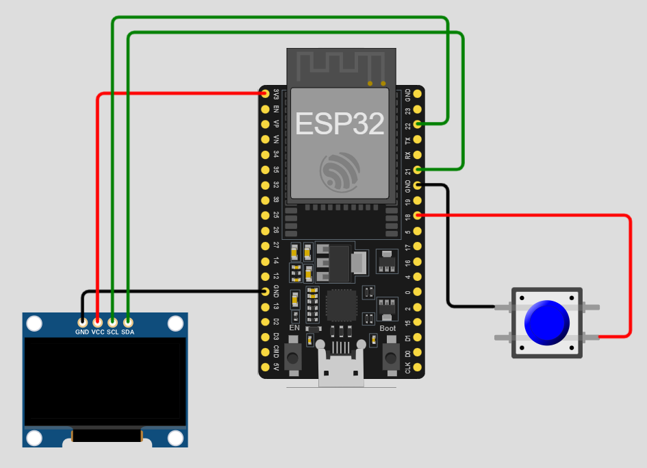

# ESP32-011-Emoji-Display-with-ESP32😀
Build a fun Emoji Display System using an ESP32, OLED display, and push buttons. With each button press, different emojis are shown on the OLED screen — a creative way to combine electronics with expressive visuals!
Here’s the **converted README-style project description** for your **Emoji Display with ESP32** 😀👇

---

## 🛠 Components Required

1. [ESP32 Development Board (30-pin)](https://robocraze.com/products/nodemcu-32-wifi-bluetooth-esp32-development-board30-pin?_pos=3&_psq=ESP32&_ss=e&_v=1.0)
2. [1.3 inch OLED Display](https://robocraze.com/products/1-3in-oled-display?_pos=6&_psq=oled&_ss=e&_v=1.0)
3. [Push Buttons](https://robocraze.com/products/4-pins-dip-momentary-square-tactile-push-button-switch-10-pieces-6x6x5mm?_pos=1&_sid=7a5518733&_ss=r)
4. [Breadboard](https://robocraze.com/products/breadboard?_pos=3&_psq=BREADBOARD&_ss=e&_v=1.0)
5. [Jumper Wires](https://robocraze.com/products/f2m-jumper-wires-20cm-40pcs?_pos=1&_psq=JUMPER+WIRES&_ss=e&_v=1.0)

---

## 🎥 Project Demo

👉 [Watch on Instagram](https://www.instagram.com/reel/DOdpbS9kxGC/?igsh=MXc1eG54azJpMzJ1cw==)

---
## Circuit Diagram

---

👉 Do you want me to also make a **short Instagram caption (under 300 characters)** for this emoji display reel?
